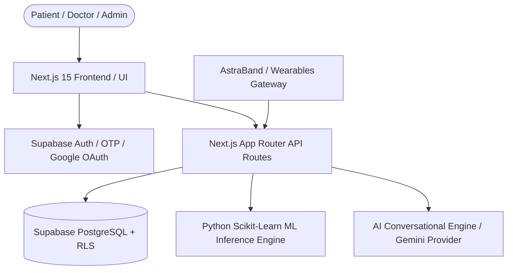

# ASTRACARE AI: Master System Architecture

> **Tagline**: “Your Health. Your Data. Your Intelligence.”  
> **Platform**: AI-Based Women’s Health Tracking and Predictive Healthcare System

---

## 1. High-Level Architecture Overview

AstraCare AI is built as a multi-tier modular healthcare intelligence platform combining:
1. **Frontend Presentation Tier**: React 19, Next.js 15 App Router, TypeScript, Tailwind CSS v4, Recharts.
2. **Backend & Platform Tier**: Supabase, PostgreSQL 15, Row Level Security (RLS), Supabase Auth & Storage.
3. **M3/M11 AI & ML Intelligence Tier**: Scikit-Learn pipelines, Python inference engine, joblib serialization, multi-domain Kaggle benchmark datasets.
4. **M4 Conversational AI Tier**: Multi-provider LLM abstraction (Gemini / OpenAI compatible / Fallback) with context retrieval and medical safety guardrails.
5. **M9 Wearables Abstraction Tier**: AstraBand Gen 2 telemetry engine supporting ECG, HRV, SpO2, and basal body temperature.

---

## 2. The 18 Unified Modules

- **M1 — User & Security Management**: Supabase Auth, OTP hashing, audit logging, RBAC (Patient, Doctor, Admin).
- **M2 — Reproductive Health**: Menstrual cycle tracker, ovulation estimation, fertile window, pregnancy, postpartum, menopause.
- **M3 — AI Health Intelligence Engine**: Health score calculation, longitudinal trend analysis, anomaly detection.
- **M4 — AI Health Assistant / Chatbot**: Context-aware clinical chatbot with medical guardrails and emergency trigger detection.
- **M5 — Health Dashboard & Analytics**: Responsive dashboard with today's health score (0-100), sub-scores, and telemetry cards.
- **M6 — Nutrition & Hydration**: Food logging, macronutrients, micronutrient guidance (Iron/Magnesium), hydration ring.
- **M7 — Fitness & Physical Activity**: Activity tracker, phase-synchronized workout recommendations, sleep architecture.
- **M8 — Mental Health & Wellness**: Daily mood check-in, allostatic stress scoring, journaling.
- **M9 — Wearable Device Management**: AstraBand Pulse Gen 2 telemetry (HR, HRV, SpO2, Skin Temp, ECG).
- **M10 — Health Reports & History**: Doctor-ready PDF generation, lab records, cryptographic consent management.
- **M11 — AI Disease Prediction & Risk Assessment**: 5 active Scikit-Learn models (PCOS, Cycle, Anemia, Diabetes, Thyroid).
- **M12 — Medication & Reminder**: Dosing schedules, adherence streaks, notifications.
- **M13 — Emergency & SOS**: Immediate geolocation and telemetry broadcast to primary contacts.
- **M14 — Doctor's Console**: Patient roster, consented longitudinal records, clinical notes authoring.
- **M15 — Admin Management**: ML model registry, Kaggle dataset provenance registry, security audit logs.
- **M16 — Notifications**: In-app alerts, reminder dispatches, clinical insights.
- **M17 — Digital Health Twin**: Multi-system computational twin (Hormonal, Circadian, Metabolic, Vitality).
- **M18 — Cloud Management**: Database migrations, automated backups, user data export, RLS data isolation.
